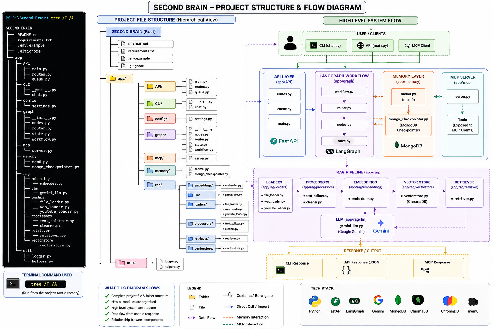
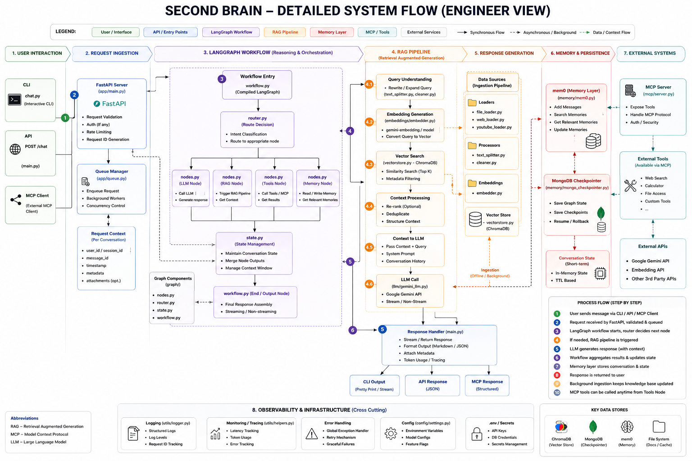
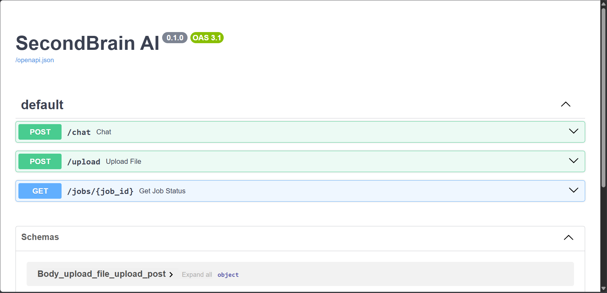

<div align="center">

# 🧠 SecondBrain AI

### Production-Ready AI Personal Knowledge Assistant

*An intelligent knowledge management system powered by Agentic RAG, LangGraph, Long-Term Memory, and the Model Context Protocol (MCP).*

[](https://www.python.org/)
[](https://fastapi.tiangolo.com/)
[](https://www.langchain.com/langgraph)
[](https://www.docker.com/)
[](https://www.mongodb.com/)
[](https://qdrant.tech/)
[](https://redis.io/)

</div>

---

## 🚀 Overview

SecondBrain AI is a **production-ready AI knowledge assistant** designed to transform personal documents into a searchable, conversational knowledge base.

Unlike a traditional chatbot, SecondBrain combines **Retrieval-Augmented Generation (RAG)**, **LangGraph-based agent orchestration**, **short-term and long-term memory**, and the **Model Context Protocol (MCP)** to create an extensible AI assistant capable of understanding documents, remembering context across conversations, and exposing its capabilities to external AI clients.

The project follows a modular architecture with asynchronous document ingestion, background processing, vector search using **Qdrant**, persistent conversational memory through **MongoDB**, and containerized deployment using **Docker Compose**.

---

## ✨ Key Highlights

- 🧠 Agentic RAG powered by **LangGraph**
- 📄 Upload and chat with PDF documents
- 🔍 Semantic vector search using **Qdrant**
- 🧠 Persistent long-term memory with **Mem0**
- 💬 Conversation state managed using **MongoDB Checkpointer**
- ⚡ FastAPI REST API
- 🔄 Redis + RQ background workers
- 🔌 Model Context Protocol (MCP) Server
- 🐳 Fully Dockerized architecture
- 📜 Structured logging and centralized error handling
- 🧪 Smoke-tested production workflow

---
# 📖 Project Overview

SecondBrain AI is a **production-ready personal knowledge assistant** that enables users to build an intelligent, searchable knowledge base from their own documents. Instead of relying solely on a large language model's built-in knowledge, SecondBrain retrieves relevant information from user-provided content and generates grounded, context-aware responses.

The system is built around an **Agentic Retrieval-Augmented Generation (RAG)** architecture powered by **LangGraph**. User requests are orchestrated through a multi-step workflow that performs intent routing, semantic retrieval, memory lookup, and response generation before returning a final answer.

To support real-world usage, SecondBrain combines multiple components into a modular backend:

- **FastAPI** for serving REST APIs
- **Qdrant** for semantic vector search
- **MongoDB** for conversation checkpoints and persistence
- **Mem0** for long-term memory management
- **Redis + RQ** for asynchronous background processing
- **Docker Compose** for reproducible deployment
- **Model Context Protocol (MCP)** for integration with external AI clients

The project follows production-oriented software engineering practices including modular architecture, centralized logging, environment-based configuration, containerization, background workers, and automated smoke testing.

Rather than being a simple chatbot, SecondBrain demonstrates how modern AI systems combine retrieval, reasoning, memory, orchestration, and external tools to build scalable intelligent applications.

---
# ✨ Features

## 🧠 AI & Intelligence

- Agentic Retrieval-Augmented Generation (RAG) powered by LangGraph
- Semantic document retrieval using Qdrant Vector Database
- Long-term memory using Mem0
- Short-term conversational memory with MongoDB Checkpointer
- Context-aware response generation using Google Gemini
- Multi-step workflow orchestration for intelligent query handling

---

## 📄 Document Processing

- PDF document ingestion
- Automatic text extraction and cleaning
- Intelligent document chunking
- Embedding generation
- Vector indexing for semantic search

---

## ⚙️ Backend & Infrastructure

- FastAPI REST API
- Asynchronous document processing using Redis + RQ
- Modular service-oriented architecture
- Centralized logging
- Custom exception handling
- Environment-based configuration
- Production-ready Docker deployment

---

## 🔌 Integrations

- Model Context Protocol (MCP) Server
- REST API endpoints
- Command Line Interface (CLI)

---

## 🧪 Quality & Reliability

- Smoke tests
- Dockerized development environment
- Persistent MongoDB storage
- Persistent Qdrant storage
- Modular project structure
---

# 🏗️ System Architecture

The following diagram illustrates the high-level architecture of SecondBrain AI.

<p align="center">
  
</p>

SecondBrain follows a modular architecture where each component has a well-defined responsibility.

| Component | Responsibility |
|-----------|----------------|
| FastAPI | Exposes REST APIs |
| LangGraph | Orchestrates the AI workflow |
| Gemini | Generates responses |
| Qdrant | Stores vector embeddings |
| MongoDB | Stores conversation state |
| Mem0 | Manages long-term memory |
| Redis + RQ | Executes background jobs |
| MCP Server | Exposes tools for external AI clients |
---

# 🔄 Detailed Workflow

The following diagram illustrates the complete execution flow inside SecondBrain AI.

<p align="center">
  
</p>

## Request Flow

```text
User
   │
   ▼
FastAPI
   │
   ▼
LangGraph Workflow
   │
   ├── Route Request
   ├── Retrieve Documents
   ├── Retrieve Memory
   ├── Grade Documents
   ├── Rewrite Query (if needed)
   ├── Generate Response
   └── Store Conversation Memory
   │
   ▼
Gemini LLM
   │
   ▼
Response
```

## Document Upload Flow

```text
PDF Upload
     │
     ▼
FastAPI
     │
     ▼
Redis Queue
     │
     ▼
RQ Worker
     │
     ▼
PDF Loader
     │
     ▼
Text Cleaning
     │
     ▼
Chunking
     │
     ▼
Gemini Embeddings
     │
     ▼
Qdrant Vector Store
```

This architecture separates document ingestion from user interaction, enabling scalable background processing while keeping the API responsive.
---

# ⚙️ Tech Stack

| Category | Technologies |
|----------|--------------|
| **Programming Language** | Python 3.13 |
| **Backend Framework** | FastAPI |
| **AI Framework** | LangChain, LangGraph |
| **LLM** | Google Gemini |
| **Embeddings** | Gemini Embedding Model |
| **Vector Database** | Qdrant |
| **Memory** | Mem0, MongoDB Checkpointer |
| **Database** | MongoDB |
| **Background Processing** | Redis, RQ Worker |
| **Document Processing** | PyPDF |
| **API Documentation** | Swagger / OpenAPI |
| **Protocol** | Model Context Protocol (MCP) |
| **Containerization** | Docker, Docker Compose |
| **Configuration** | Python Dotenv |
| **Testing** | Smoke Tests |
| **Version Control** | Git, GitHub |
---

# 📂 Project Structure

```text
SecondBrain/
│
├── secondbrain/
│   ├── agent/              # Agent orchestration
│   ├── agents/             # Specialized AI agents
│   ├── api/                # FastAPI endpoints
│   ├── cli/                # Command-line interface
│   ├── core/               # Logging & exceptions
│   ├── graph/              # LangGraph workflow
│   ├── mcp_server/         # MCP server implementation
│   ├── memory/             # Short & long-term memory
│   ├── models/             # Request & response models
│   ├── queues/             # Redis queue & worker
│   ├── rag/                # RAG pipeline
│   ├── tools/              # AI tools
│   ├── data/               # Runtime data
│   └── main.py             # FastAPI application
│
├── tests/                  # Smoke tests
├── assets/                 # README images
├── logs/                   # Application logs
│
├── Dockerfile
├── docker-compose.yml
├── requirements.txt
├── pyproject.toml
├── .env.example
└── README.md
```

---

## 📦 Core Components

| Module | Description |
|---------|-------------|
| **RAG Pipeline** | Document ingestion, chunking, embeddings, retrieval |
| **LangGraph** | Agent workflow orchestration |
| **Memory** | Short-term & long-term conversational memory |
| **FastAPI** | REST API layer |
| **Redis Worker** | Background document processing |
| **Qdrant** | Vector similarity search |
| **MongoDB** | Conversation persistence |
| **MCP Server** | External AI tool integration |
---

# 🚀 Installation & Quick Start

## Prerequisites

Before getting started, ensure you have the following installed:

- Python 3.13+
- Docker & Docker Compose
- Git
- Google Gemini API Key

---

## Clone the Repository

```bash
git clone https://github.com/MandarGavali/SecondBrain.git
cd SecondBrain
```

---

## Configure Environment Variables

Create a `.env` file in the project root.

```env
GOOGLE_API_KEY=your_google_api_key

MONGODB_URI=mongodb://localhost:27017
QDRANT_URL=http://localhost:6333
REDIS_URL=redis://localhost:6379
```

---

## Run with Docker (Recommended)

Start the complete application stack:

```bash
docker compose up --build
```

This launches:

- FastAPI Server
- Redis
- MongoDB
- Qdrant
- Background Worker

Swagger UI:

```
http://localhost:8000/docs
```

---

## Run Locally (Without Docker)

Create a virtual environment:

```bash
python -m venv venv
```

Activate it.

Windows:

```bash
venv\Scripts\activate
```

Linux / macOS:

```bash
source venv/bin/activate
```

Install dependencies:

```bash
pip install -r requirements.txt
```

Start the FastAPI server:

```bash
uvicorn secondbrain.main:app --reload
```

Start the Redis worker in another terminal:

```bash
python -m secondbrain.queues.worker
```

The API will be available at:

```
http://localhost:8000
```

Swagger UI:

```
http://localhost:8000/docs
```
---

# 🐳 Docker Deployment

SecondBrain is fully containerized using Docker Compose, making the entire application stack reproducible with a single command.

## Containers

| Container | Purpose |
|-----------|---------|
| `secondbrain-api` | FastAPI application |
| `secondbrain-worker` | Background document processing |
| `secondbrain-mongodb` | Conversation state & memory |
| `secondbrain-qdrant` | Vector database |
| `secondbrain-redis` | Background job queue |

---

## Start the Stack

```bash
docker compose up --build
```

Run in detached mode:

```bash
docker compose up -d
```

Stop the stack:

```bash
docker compose down
```

Rebuild after dependency changes:

```bash
docker compose up --build --force-recreate
```

---

## Verify Services

```bash
docker ps
```

Expected running containers:

- secondbrain-api
- secondbrain-worker
- secondbrain-mongodb
- secondbrain-qdrant
- secondbrain-redis

---

## Persistent Storage

Docker volumes are used to persist application data.

| Volume | Stores |
|---------|--------|
| `mongodb_data` | MongoDB data |
| `qdrant_data` | Vector embeddings |

This ensures conversations and indexed documents remain available even after restarting the containers.
---

# 📡 API Reference

Once the application is running, Swagger documentation is available at:

```
http://localhost:8000/docs
```

<p align="center">
  
</p>

## REST Endpoints

| Method | Endpoint | Description |
|---------|----------|-------------|
| **POST** | `/upload` | Upload and index PDF documents |
| **POST** | `/chat` | Chat with indexed documents |
| **GET** | `/jobs/{job_id}` | Check background processing status |

---

## Example Upload Request

```bash
curl -X POST \
  "http://localhost:8000/upload" \
  -F "file=@document.pdf"
```

---

## Example Chat Request

```json
POST /chat

{
  "query": "Summarize the uploaded document."
}
```
---

# 🔌 Model Context Protocol (MCP) Integration

SecondBrain includes a dedicated **Model Context Protocol (MCP) Server**, allowing external AI clients (such as Claude Desktop, Cursor, VS Code, and other MCP-compatible applications) to interact directly with the knowledge base.

Instead of exposing only REST APIs, MCP enables AI assistants to invoke tools, retrieve documents, and access memory through a standardized protocol.

## Available MCP Tools

| Tool | Description |
|------|-------------|
| `ask_secondbrain` | Query the complete RAG pipeline with memory support |
| `search_documents` | Perform semantic search across indexed documents |
| `upload_document` | Upload new documents to the knowledge base |
| `memory` | Access and manage long-term memory |

---

## MCP Capabilities

- AI-assisted document search
- Agentic RAG workflow execution
- Long-term memory retrieval
- Knowledge base interaction
- Tool-based AI integration
- Standardized MCP interface

---

## MCP Architecture

```text
AI Client
(Claude Desktop / Cursor / VS Code)
            │
            ▼
      MCP Server
            │
            ▼
    SecondBrain Tools
            │
            ▼
 LangGraph Workflow
            │
     ┌──────┴────────┐
     ▼               ▼
 MongoDB         Qdrant
     │               │
     └──────┬────────┘
            ▼
      Google Gemini
```

The MCP server allows external AI systems to securely access the capabilities of SecondBrain without directly interacting with the internal application components.
---

# 🖼️ Screenshots

## System Architecture

<p align="center">
  
</p>

---

## Engineering Workflow

<p align="center">
  
</p>

---

## FastAPI Swagger UI

<p align="center">
  
</p>

---

# 🚧 Future Improvements

SecondBrain is designed with extensibility in mind. Some planned enhancements include:

- 🌐 Web-based user interface
- 🔐 User authentication and role-based access control
- 📚 Support for additional document formats (DOCX, Markdown, HTML, TXT)
- ☁️ Cloud storage integration (AWS S3, Google Cloud Storage)
- 🔍 Hybrid Search (Semantic + Keyword Search)
- ⚡ Streaming responses using Server-Sent Events (SSE)
- 📈 Observability with Prometheus & Grafana
- 📊 Monitoring and analytics dashboard
- 🧩 Plugin architecture for custom tools
- 🤖 Multi-agent collaboration workflows
- 🗣 Voice input and speech synthesis
- 🌍 Multi-language document support
- 📱 Web and mobile client applications
- 🚀 Kubernetes deployment for horizontal scaling

---

# 🤝 Contributing

Contributions are welcome!

If you'd like to improve SecondBrain, please follow these steps:

1. Fork the repository
2. Create a feature branch

```bash
git checkout -b feature/your-feature
```

3. Commit your changes

```bash
git commit -m "Add new feature"
```

4. Push to your branch

```bash
git push origin feature/your-feature
```

5. Open a Pull Request

Please ensure your code follows the existing project structure and coding style.

---

# 📄 License

This project is licensed under the **MIT License**.

See the `LICENSE` file for more information.

---

# 🙏 Acknowledgements

This project was built using several outstanding open-source technologies.

Special thanks to the teams behind:

- LangChain
- LangGraph
- Google Gemini
- FastAPI
- Qdrant
- MongoDB
- Redis
- Mem0
- Docker
- Model Context Protocol (MCP)

Their work makes projects like SecondBrain possible.

---

<div align="center">

## ⭐ If you found this project interesting, consider giving it a star!

**Built with ❤️ by [Mandar Gavali](https://github.com/MandarGavali)**

</div>